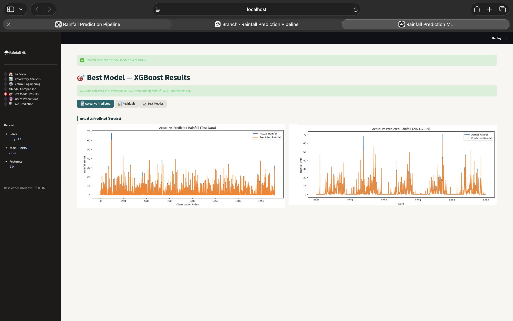
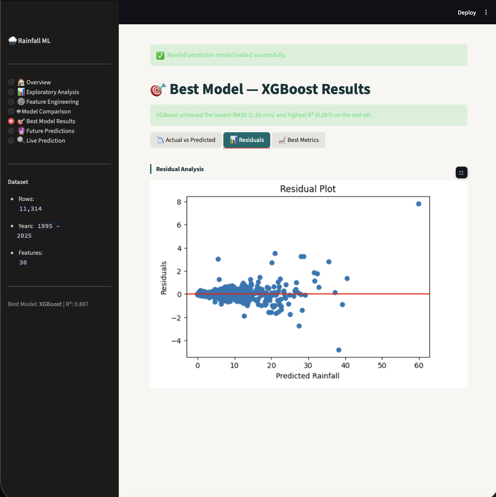
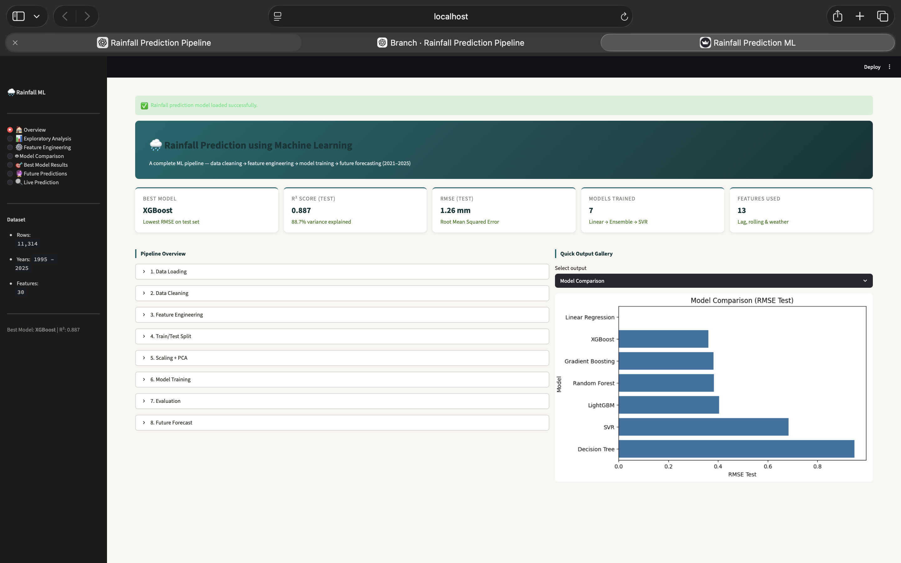
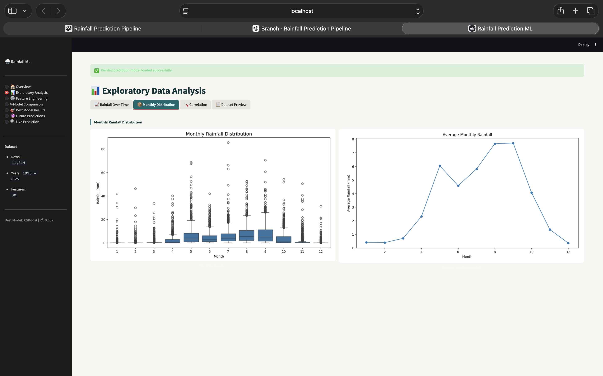
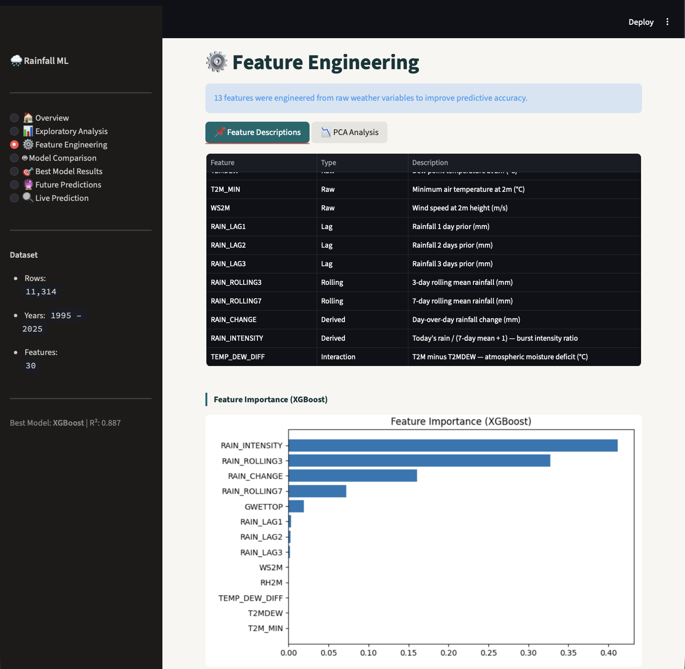
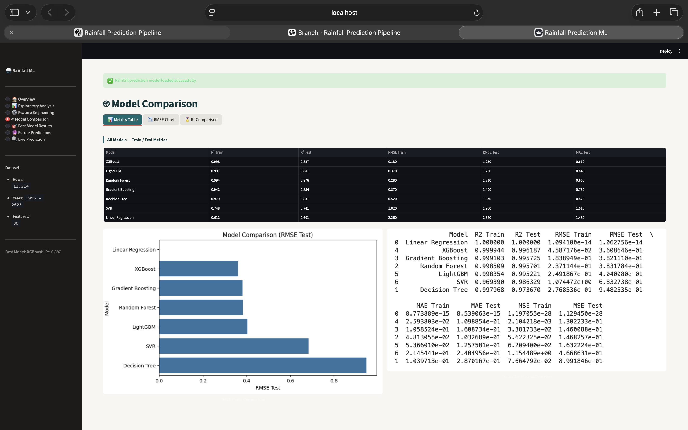
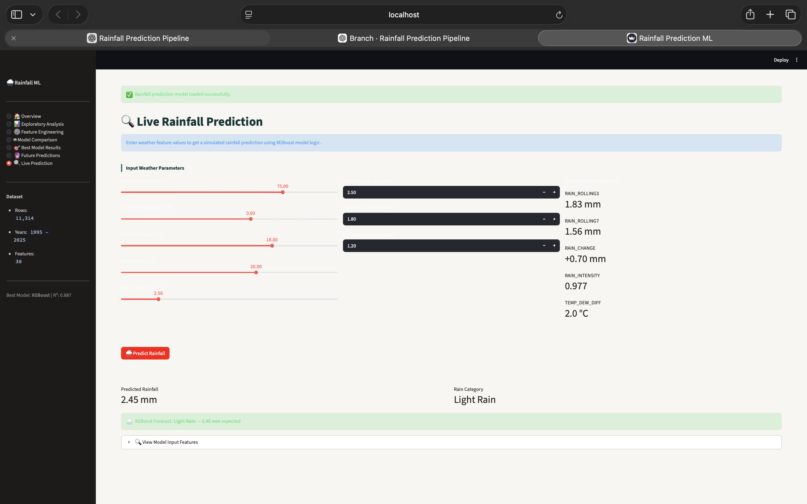

# 🌧️ Rainfall Prediction Using Machine Learning

<p align="center">
  <strong>An end-to-end machine learning system for daily rainfall prediction using meteorological data, temporal feature engineering, ensemble learning, and an interactive Streamlit application.</strong>
</p>

<p align="center">
  <a href="https://rainfall-prediction-ml-ydhagf8htgkxur45jbdnwp.streamlit.app">
    
  </a>
  <a href="https://github.com/sindgisrishtis/rainfall-prediction-ml">
    
  </a>
</p>

<p align="center">
  
  
  
  
</p>

---

## 🚀 Live Demo

🌧️ **[Launch the Rainfall Prediction Application](https://rainfall-prediction-ml-ydhagf8htgkxur45jbdnwp.streamlit.app)**

💻 **[View the Source Code on GitHub](https://github.com/sindgisrishtis/rainfall-prediction-ml)**

> An interactive web application for exploring rainfall patterns, comparing machine learning models, analyzing predictions, and generating rainfall estimates using the trained XGBoost model.

---

## 📌 Overview

**Rainfall Prediction Using Machine Learning** is an end-to-end regression project that predicts daily rainfall from historical meteorological observations and recent rainfall patterns.

The project follows a complete machine learning workflow, beginning with data cleaning and exploratory analysis, followed by temporal feature engineering, chronological train/test splitting, model development, evaluation, error analysis, model serialization, and deployment.

Four regression models were evaluated:

- Decision Tree Regressor
- Random Forest Regressor
- Support Vector Regression (SVR)
- XGBoost Regressor

Among the evaluated models, **XGBoost achieved the best test-set performance with an R² score of 0.9275**, and was selected as the final model for the deployed application.

The trained model is serialized using **Joblib** and integrated into a **Streamlit application** that provides an interactive interface for rainfall prediction.

---

## 📑 Table of Contents

- [Overview](#-overview)
- [Key Highlights](#-key-highlights)
- [Dataset](#-dataset)
- [Data Cleaning & Preprocessing](#-data-cleaning--preprocessing)
- [Exploratory Data Analysis](#-exploratory-data-analysis)
- [Feature Engineering](#-feature-engineering)
- [Time-Aware Data Splitting](#-time-aware-data-splitting)
- [ML Architecture & Workflow](#-ml-architecture--workflow)
- [Models Evaluated](#-models-evaluated)
- [Model Comparison & Final Model](#-model-comparison--final-model)
- [Feature Importance](#-feature-importance)
- [Error & Residual Analysis](#-error--residual-analysis)
- [Overfitting & Generalization](#-overfitting--generalization)
- [Streamlit Application](#-streamlit-application)
- [Screenshots](#-screenshots)
- [Project Structure](#-project-structure)
- [Run Locally](#-run-locally)
- [Deployment](#-deployment)
- [Limitations](#-limitations)
- [Future Improvements](#-future-improvements)
- [Author](#-author)

---

## ✨ Key Highlights

- 📊 Daily rainfall prediction using historical meteorological observations
- 🧹 Structured data cleaning and preprocessing pipeline
- 📈 Exploratory analysis of rainfall trends and seasonality
- 🧠 Temporal and rainfall-history feature engineering
- ⏳ Chronological train/test splitting to preserve temporal order
- 🤖 Comparison of four machine learning regression models
- 🏆 XGBoost selected as the final model
- 📐 Evaluation using R², RMSE, MAE, and MSE
- 🔍 Feature importance analysis
- 📉 Actual-vs-predicted and residual error analysis
- ⚠️ Training-vs-test generalization analysis
- 💾 Trained model serialized using Joblib
- 🌐 Interactive Streamlit prediction interface
- 🚀 Deployed using Streamlit Community Cloud
- 📁 Organized repository structure for reproducibility

---

## 📊 Dataset

The project uses daily meteorological observations containing atmospheric, temperature, humidity, wind, radiation, soil-moisture, and precipitation variables.

### Dataset Information

| Property | Details |
|---|---|
| **Time Period** | 1995–2025 |
| **Temporal Resolution** | Daily |
| **Location** | Latitude 18.8209, Longitude 98.9899 |
| **Target Variable** | `PRECTOTCORR` |
| **Prediction Task** | Daily rainfall regression |

### Meteorological Variables

| Feature | Description |
|---|---|
| `ALLSKY_SFC_SW_DWN` | All-sky surface shortwave downward irradiance |
| `ALLSKY_SFC_SW_DNI` | All-sky surface direct normal irradiance |
| `T2M` | Temperature at 2 meters |
| `T2MDEW` | Dew-point temperature |
| `T2MWET` | Wet-bulb related temperature variable |
| `T2M_MAX` | Maximum temperature |
| `T2M_MIN` | Minimum temperature |
| `PRECTOTCORR` | Corrected precipitation / rainfall |
| `RH2M` | Relative humidity |
| `QV2M` | Specific humidity |
| `WS2M` | Wind speed |
| `GWETTOP` | Top-layer soil wetness |

---

## 🧹 Data Cleaning & Preprocessing

The raw meteorological data was prepared before performing feature engineering and model training.

The preprocessing workflow included:

- Loading and structuring the raw meteorological dataset
- Handling the dataset's header and metadata structure
- Selecting relevant numerical variables
- Checking data types and dataset consistency
- Checking for missing values
- Sorting observations chronologically
- Preparing the rainfall target variable
- Creating the cleaned modeling dataset
- Removing observations affected by lag and rolling-window feature generation

The cleaned dataset is maintained at:

`data/cleaned_rainfall_dataset.csv`

The preprocessing stage ensures that the data used for model development is structured, chronological, and suitable for downstream feature engineering and regression modeling.

---

## 📈 Exploratory Data Analysis

Exploratory Data Analysis was performed to understand the statistical and temporal characteristics of rainfall before model training.

The analysis focused on:

- Rainfall distribution
- Rainfall trends over time
- Monthly rainfall seasonality
- Variability in rainfall
- Relationships between meteorological variables
- Correlation patterns
- Distribution of important weather variables

### 🌦️ Rainfall Seasonality

Monthly rainfall distributions were analyzed to identify seasonal patterns and differences in rainfall behavior across the year.

This analysis helps establish the importance of temporal information when modeling rainfall and provides a foundation for the subsequent feature-engineering stage.

EDA visualizations and project screenshots are available in the `assets/` directory.

---

## 🔧 Feature Engineering

Feature engineering was a key part of the rainfall prediction pipeline. In addition to the original meteorological variables, temporal and rainfall-history features were created to capture short-term rainfall behavior.

### 🌧️ Rainfall Lag Features

Previous rainfall observations were incorporated as predictive features:

| Feature | Description |
|---|---|
| `RAIN_LAG1` | Rainfall from the previous day |
| `RAIN_LAG2` | Rainfall from two days earlier |
| `RAIN_LAG3` | Rainfall from three days earlier |

These features allow the model to use recent rainfall history when estimating rainfall.

### 📊 Rolling Rainfall Features

Rolling rainfall features were added to capture recent rainfall trends:

| Feature | Description |
|---|---|
| `RAIN_ROLLING3` | 3-day rolling rainfall average |
| `RAIN_ROLLING7` | 7-day rolling rainfall average |

These features provide information about recent rainfall accumulation and short-term temporal patterns.

### 🧠 Additional Engineered Features

The final XGBoost inference pipeline uses the following 13 features:

- `RH2M`
- `GWETTOP`
- `T2MDEW`
- `T2M_MIN`
- `WS2M`
- `RAIN_LAG1`
- `RAIN_LAG2`
- `RAIN_LAG3`
- `RAIN_ROLLING3`
- `RAIN_ROLLING7`
- `RAIN_CHANGE`
- `RAIN_INTENSITY`
- `TEMP_DEW_DIFF`

Additional derived features include:

- **`RAIN_CHANGE`** — captures change in rainfall relative to recent observations.
- **`RAIN_INTENSITY`** — represents rainfall intensity-related information.
- **`TEMP_DEW_DIFF`** — captures the difference between temperature and dew-point temperature.

The engineered feature set combines current meteorological conditions with recent rainfall behavior to provide the models with richer predictive information.

---

## ⏳ Time-Aware Data Splitting

Because rainfall observations are time-dependent, the dataset was split chronologically rather than randomly shuffled.

The workflow preserves the temporal order of observations:

**Earlier Observations → Training Set → Later Observations → Test Set**

This approach helps prevent future observations from being introduced into the training data and provides a more realistic evaluation of how the model performs on unseen later observations.

The same time-aware splitting strategy was used when comparing the regression models so that their test-set performance could be evaluated consistently.

---

## 🧠 ML Architecture & Workflow

The complete machine learning pipeline follows a chronological workflow from raw meteorological data to rainfall prediction.

```text
Raw Meteorological Data
          ↓
Data Cleaning & Validation
          ↓
Exploratory Data Analysis
          ↓
Feature Engineering
          ↓
Chronological Train / Test Split
          ↓
Model Training
          ↓
     ┌────┬────┬────┐
     ↓    ↓    ↓    ↓
Decision Random  SVR XGBoost
 Tree   Forest
     ↓    ↓    ↓    ↓
     └────┴────┴────┘
          ↓
Model Evaluation
          ↓
Model Comparison
          ↓
Best Model Selection
          ↓
XGBoost Regressor
          ↓
Model Serialization
          ↓
rainfall_prediction_model.pkl
          ↓
Streamlit Application
          ↓
Rainfall Prediction
```
---

## 🤖 Models Evaluated

Four supervised machine learning regression models were trained and evaluated for daily rainfall prediction.

### 1. Decision Tree Regressor

A tree-based regression model used as a baseline to capture nonlinear relationships between meteorological variables and rainfall.

### 2. Random Forest Regressor

An ensemble of decision trees designed to improve predictive stability and reduce the variance associated with a single decision tree.

### 3. Support Vector Regression (SVR)

A kernel-based regression approach used to model potentially nonlinear relationships between the engineered weather and rainfall features.

### 4. XGBoost Regressor

A gradient-boosted tree ensemble designed to capture complex nonlinear relationships and interactions between the meteorological and rainfall-history features.

XGBoost achieved the strongest performance on the unseen test set and was selected as the final model for deployment.

---

## 🏆 Model Comparison & Final Model

The models were evaluated using four regression metrics:

- **R² Score** — measures the proportion of variance explained by the model.
- **RMSE** — measures the magnitude of prediction errors while giving greater weight to larger errors.
- **MAE** — measures the average absolute prediction error.
- **MSE** — measures the average squared prediction error.

### Test-Set Performance

| Model | RMSE | MAE | R² Score |
|---|---:|---:|---:|
| Decision Tree | 3.7367 | 1.2147 | 0.7409 |
| Random Forest | 2.2182 | 0.7947 | 0.9087 |
| SVR | 2.5073 | 1.1311 | 0.8834 |
| **XGBoost** | **1.9761** | **0.6504** | **0.9275** |

### 🥇 Final Model: XGBoost

XGBoost was selected because it achieved the best overall performance on the unseen test set.

**Final test-set performance:**

| Metric | XGBoost |
|---|---:|
| **R² Score** | **0.927545** |
| **RMSE** | **1.976104 mm** |
| **MAE** | **0.650386 mm** |
| **MSE** | **3.904986** |

The selected XGBoost model was serialized using Joblib and saved as:

`models/rainfall_prediction_model.pkl`

The serialized model is used by the Streamlit application for rainfall inference.

---

## 🔍 Feature Importance

Feature importance analysis was performed to understand which input variables contributed most strongly to the tree-based rainfall prediction models.

The analysis highlighted the importance of recent rainfall history and environmental conditions.

The most influential features included:

| Feature | Importance |
|---|---:|
| `RAIN_ROLLING3` | 0.601953 |
| `GWETTOP` | 0.141506 |
| `RAIN_LAG2` | 0.121260 |
| `RAIN_LAG1` | 0.090888 |
| `RH2M` | 0.006433 |

The results indicate that **recent rainfall behavior**, particularly the 3-day rolling rainfall feature and previous-day rainfall observations, provides strong predictive information.

This supports the use of lag and rolling features as an important part of the rainfall prediction pipeline.

---

## 📉 Error & Residual Analysis

Model evaluation was extended beyond overall performance metrics to understand how closely the predictions followed the observed rainfall values.

### Actual vs Predicted Rainfall

The actual-versus-predicted visualization compares the observed rainfall values with the rainfall values predicted by the final XGBoost model.

This helps assess whether the model is able to follow the overall variation and temporal behavior of rainfall in the test set.



### Residual Error Distribution

Residuals were calculated as the difference between actual and predicted rainfall:

`Residual = Actual Rainfall − Predicted Rainfall`

The residual distribution was visualized to examine the magnitude and spread of prediction errors.



Residual analysis provides an additional perspective on model behavior beyond R², RMSE, and MAE.

---

## ⚠️ Overfitting & Generalization

The final XGBoost model was evaluated on both the training and unseen test sets to assess its generalization behavior.

| Metric | Training Set | Test Set |
|---|---:|---:|
| R² Score | 0.999477 | 0.927545 |
| RMSE | 0.139139 | 1.976104 |
| MAE | 0.090503 | 0.650386 |
| MSE | 0.019360 | 3.904986 |

The training performance is substantially stronger than the test performance, indicating that the model has learned the training data very closely and exhibits **some degree of overfitting**.

However, the test-set R² of **0.9275**, together with an RMSE of **1.9761 mm** and MAE of **0.6504 mm**, demonstrates strong predictive performance on unseen observations.

Therefore, the model is not considered perfectly fitted; instead, it shows **strong generalization with a noticeable but manageable training-to-test performance gap**.

For this project, the test-set results are treated as the primary indicator of real-world predictive performance.

---

## 🌐 Streamlit Application

The trained XGBoost model was integrated into an interactive Streamlit application to provide a user-friendly interface for rainfall prediction.

### Application Features

The application provides the following sections:

- **📊 Overview** — Project summary, dataset information, and key model results.
- **📈 Exploratory Analysis** — Rainfall distributions, trends, and seasonal patterns.
- **🔧 Feature Engineering** — Explanation of the engineered rainfall and meteorological features.
- **🤖 Model Comparison** — Comparison of Decision Tree, Random Forest, SVR, and XGBoost.
- **🏆 Model Performance** — Final XGBoost evaluation metrics and generalization analysis.
- **📉 Prediction Analysis** — Actual-versus-predicted rainfall and residual analysis.
- **🌧️ Live Prediction** — Interactive rainfall prediction using the trained XGBoost model.


## 🌧️ Live Prediction Workflow

The application accepts meteorological and recent rainfall inputs and generates an interactive rainfall prediction using the trained XGBoost model.

```text
User Input
     ↓
Relative Humidity
     ↓
Soil Wetness
     ↓
Dew Point Temperature
     ↓
Minimum Air Temperature
     ↓
Wind Speed
     ↓
Recent Rainfall (1–3 Days)
     ↓
Automatic Feature Engineering
     ↓
Rolling Rainfall Features
     ↓
XGBoost Model
     ↓
Predicted Rainfall
     ↓
Rainfall Category
     ↓
Prediction Result
```

The trained model is loaded from:

`models/rainfall_prediction_model.pkl`

This allows the application to perform inference without retraining the model every time the application starts.

### 🌍 Live Application

👉 **[Open the Rainfall Prediction Application](https://rainfall-prediction-ml-ydhagf8htgkxur45jbdnwp.streamlit.app)**

---

## 🖼️ Screenshots

The following screenshots demonstrate the major components of the deployed application and machine learning workflow.

### 📊 Project Overview



### 📈 Exploratory Data Analysis



### 🔧 Feature Engineering



### 🤖 Model Comparison



### 📉 Actual vs Predicted Rainfall


### 📊 Residual Analysis


### 🌧️ Live Rainfall Prediction



---

## 📁 Project Structure

The repository follows a clean and modular structure that separates the application, data, trained model, notebook, outputs, visual assets, and supporting source code.

### Repository Layout

    rainfall-prediction-ml/
    │
    ├── app.py
    ├── README.md
    ├── requirements.txt
    ├── .gitignore
    │
    ├── assets/
    │   ├── 01_overview.png
    │   ├── 02_EDA.png
    │   ├── 03_feature_engineering.png
    │   ├── 04_model_comparison.png
    │   ├── 05_actual_vs_predicted.png
    │   ├── 06_residual_analysis.png
    │   └── 07_live_prediction.png
    │
    ├── data/
    │   └── cleaned_rainfall_dataset.csv
    │
    ├── models/
    │   └── rainfall_prediction_model.pkl
    │
    ├── notebooks/
    │   └── rainfall_analysis_main.ipynb
    │
    ├── outputs/
    │   └── rainfall_predictions_2021_2025.csv
    │
    └── src/
        ├── rainfall-ml-pipeline.py
        └── predict_rainfall_demo.py

### Directory & File Description

| Path | Purpose |
|---|---|
| `app.py` | Streamlit application and rainfall prediction interface |
| `assets/` | Screenshots and visualization assets used in the project documentation |
| `data/` | Cleaned dataset used for analysis and modeling |
| `models/` | Serialized trained XGBoost model |
| `notebooks/` | Main Jupyter notebook containing the ML workflow |
| `outputs/` | Generated rainfall prediction results |
| `src/` | Supporting machine learning and prediction scripts |
| `requirements.txt` | Python dependencies required to run the project |
| `.gitignore` | Files excluded from version control |
| `README.md` | Project documentation |

---

## 💻 Run Locally

Follow these steps to run the rainfall prediction application on your local machine.

### 1. Clone the Repository

    git clone https://github.com/sindgisrishtis/rainfall-prediction-ml.git
    cd rainfall-prediction-ml

### 2. Create a Virtual Environment

#### macOS / Linux

    python3 -m venv venv
    source venv/bin/activate

#### Windows

    python -m venv venv
    venv\Scripts\activate

### 3. Install Dependencies

    pip install -r requirements.txt

### 4. Run the Streamlit Application

    streamlit run app.py

The application will be available locally at:

`http://localhost:8501`

---

## 📓 Run the Jupyter Notebook

To reproduce the analysis and model development workflow, launch Jupyter Notebook:

    jupyter notebook

Then open:

`notebooks/rainfall_analysis_main.ipynb`

The notebook contains the main workflow covering:

- Data preprocessing
- Exploratory data analysis
- Feature engineering
- Time-aware data splitting
- Model training
- Model evaluation
- Feature importance analysis
- Prediction and error analysis

---

## 🚀 Deployment

The application is deployed using **Streamlit Community Cloud** and is available as a live web application.

### 🌐 Live Application

👉 **[Launch the Rainfall Prediction App](https://rainfall-prediction-ml-ydhagf8htgkxur45jbdnwp.streamlit.app)**

### Deployment Configuration

| Setting | Value |
|---|---|
| **Platform** | Streamlit Community Cloud |
| **Repository** | `sindgisrishtis/rainfall-prediction-ml` |
| **Branch** | `main` |
| **Entry Point** | `app.py` |
| **Model** | `models/rainfall_prediction_model.pkl` |

The application installs the required Python dependencies from `requirements.txt` and loads the serialized XGBoost model for inference.

---

## ⚠️ Limitations

Although the final model achieves strong test-set performance, rainfall prediction remains a challenging problem due to the highly variable nature of precipitation.

Key limitations include:

- The model is trained for the geographical location represented by the dataset.
- Extreme rainfall events may be more difficult to predict accurately.
- Prediction quality depends on the quality and relevance of the input meteorological and rainfall-history features.
- The current application provides point predictions rather than probabilistic prediction intervals.
- The difference between training and test performance indicates some degree of overfitting.

Therefore, the model should be considered a machine learning prediction system rather than an operational meteorological forecasting service.

---

## 🔮 Future Improvements

Potential improvements to the project include:

- Hyperparameter optimization using time-series appropriate cross-validation
- More robust multi-step rainfall forecasting
- Additional meteorological and environmental variables
- Improved modeling of extreme rainfall events
- Prediction intervals and uncertainty estimation
- Automated model retraining
- Experiment tracking and model versioning
- Model monitoring after deployment
- CI/CD automation
- Containerization using Docker

---

## 👩‍💻 Author

**Srishti S Sindgi**  
AI & ML Engineer | Data Science | Software Engineering

Passionate about building intelligent systems, machine learning solutions, and production-oriented software applications.

**GitHub:** [@sindgisrishtis](https://github.com/sindgisrishtis)  
**LinkedIn:** [LinkedIn Profile](https://www.linkedin.com/in/srishti-s-sindgi/)  
**Email:** sindgisrishtis@gmail.com

---

⭐ If you found this project useful, consider giving the repository a star.

---

<p align="center">
  <strong>🌧️ Built with Python, Scikit-learn, XGBoost & Streamlit</strong>
</p>
